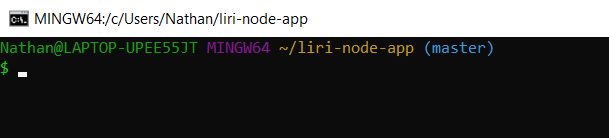
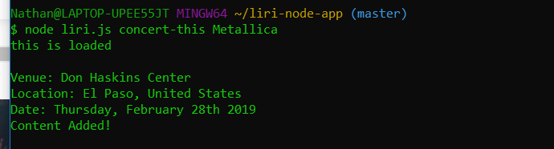
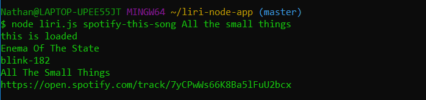
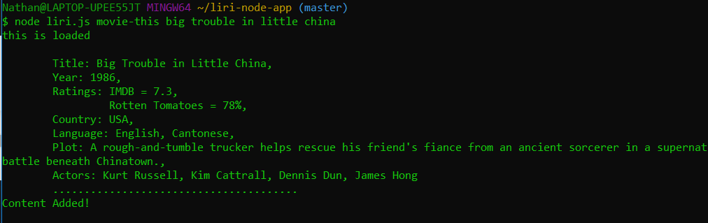
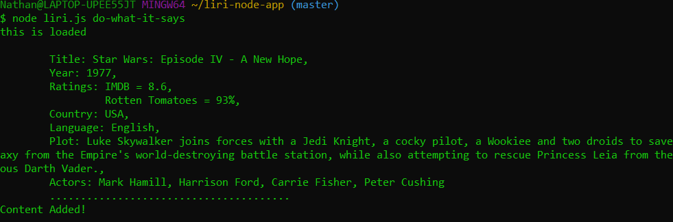

# liri-node-app
Search from the command line Spotify, Bands in Town, and OMDB for music, concerts and movies. This app was built to add on to my knowledge of node.js and node modules. Also, this help me get familiar running files from the command line.

This app runs directly from the command line using node.js. Once you have the package.json, simply run npm install inside your to gather all the node module dependencies. Once installed using npm or Node Package Manager. You'll be able to search for artists upcoming show, information on a movie, get more info on a song title and even get a random suggestion of for any of the above.  All of the search results are then saved in a local log.txt file. This app uses Axios, Spotify, Dotenv, and Moment. For more information/documentation on these awesome node packages see these links here.

https://www.npmjs.com/package/axios

https://www.npmjs.com/package/node-spotify-api

https://www.npmjs.com/package/dotenv

https://momentjs.com/

How to use:
Open your command line. 

To search first input "node" followed by our file name "liri.js" then your type of search:
"concert-this" will search for upcoming shows by an artist.

"spotify-this-song" will search by a song title for artist, album and a link to this song.

"movie-this" will search by movie for actors, ratings, and plot information.

"do-what-it-says" will retrieve a random suggestion from any of the above options.
